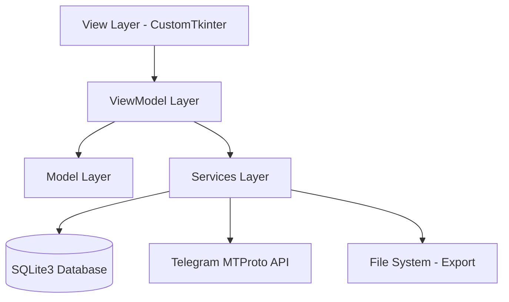

# Design Document - Turkish Phone Validator

## Overview

Turkish Phone Validator, MVVM mimarisi kullanarak geliştirilmiş modern bir Python masaüstü uygulamasıdır. Uygulama, Türk telefon numaralarını rastgele oluşturur, Telegram MTProto API'si ile doğrular ve sonuçları SQLite3 veritabanında saklar. CustomTkinter ile modern dark mode destekli arayüz sunar.

## Architecture

### High-Level Architecture



### MVVM Pattern Implementation

- **View**: CustomTkinter UI bileşenleri, sadece görsel sunum
- **ViewModel**: UI ile Model arasında köprü, business logic
- **Model**: Veri modelleri ve domain entities
- **Services**: External API'ler, veritabanı, dosya işlemleri

## Components and Interfaces

### 1. Core Models

#### PhoneNumber Model
```python
@dataclass
class PhoneNumber:
    number: str
    name: Optional[str]
    is_valid: Optional[bool]
    checked_date: Optional[datetime]
    operator_code: str
    
    def validate_format(self) -> bool
    def get_display_format(self) -> str
```

#### ValidationResult Model
```python
@dataclass
class ValidationResult:
    phone_number: PhoneNumber
    is_telegram_registered: bool
    validation_date: datetime
    response_time: float
    error_message: Optional[str]
```

#### AppSettings Model
```python
@dataclass
class AppSettings:
    telegram_api_id: str
    telegram_api_hash: str
    parallel_threads: int
    rate_limit_min: int
    rate_limit_max: int
    dark_mode: bool
    export_path: str
```

### 2. Service Layer

#### TelegramService
```python
class TelegramService:
    def __init__(self, api_id: str, api_hash: str)
    async def check_phone_registered(self, phone: str) -> ValidationResult
    async def initialize_session(self) -> bool
    def apply_rate_limiting(self) -> None
    def handle_flood_wait(self, seconds: int) -> None
```

#### DatabaseService
```python
class DatabaseService:
    def __init__(self, db_path: str)
    def create_tables(self) -> None
    def save_phone_number(self, phone: PhoneNumber) -> None
    def get_phone_number(self, number: str) -> Optional[PhoneNumber]
    def get_all_valid_numbers(self) -> List[PhoneNumber]
    def get_all_invalid_numbers(self) -> List[PhoneNumber]
    def search_numbers(self, query: str) -> List[PhoneNumber]
    def is_number_checked(self, number: str) -> bool
```

#### PhoneGeneratorService
```python
class PhoneGeneratorService:
    TURKISH_OPERATORS = ['50X', '51X', '52X', '53X', '54X', '55X', '559']
    
    def generate_random_number(self) -> str
    def generate_batch(self, count: int) -> List[str]
    def validate_turkish_format(self, number: str) -> bool
```

#### ExportService
```python
class ExportService:
    def export_to_csv(self, numbers: List[PhoneNumber], path: str) -> bool
    def export_to_excel(self, numbers: List[PhoneNumber], path: str) -> bool
    def export_to_json(self, numbers: List[PhoneNumber], path: str) -> bool
    def export_to_txt(self, numbers: List[PhoneNumber], path: str) -> bool
```

#### FileImportService
```python
class FileImportService:
    def import_from_csv(self, file_path: str) -> List[str]
    def import_from_excel(self, file_path: str) -> List[str]
    def import_from_txt(self, file_path: str) -> List[str]
    def validate_import_format(self, file_path: str) -> bool
```

### 3. ViewModel Layer

#### MainViewModel
```python
class MainViewModel:
    def __init__(self, services: ServiceContainer)
    
    # Observable Properties
    current_phone: Observable[str]
    validation_progress: Observable[float]
    total_checked: Observable[int]
    valid_count: Observable[int]
    invalid_count: Observable[int]
    is_running: Observable[bool]
    status_message: Observable[str]
    
    # Commands
    async def start_validation(self) -> None
    async def stop_validation(self) -> None
    async def import_phone_list(self, file_path: str) -> None
    async def export_results(self, format: str, valid_only: bool) -> None
    def search_numbers(self, query: str) -> List[PhoneNumber]
```

#### SettingsViewModel
```python
class SettingsViewModel:
    def __init__(self, settings_service: SettingsService)
    
    # Observable Properties
    settings: Observable[AppSettings]
    
    # Commands
    def save_settings(self, settings: AppSettings) -> None
    def test_telegram_connection(self) -> bool
    def reset_to_defaults(self) -> None
```

### 4. View Layer

#### MainWindow
```python
class MainWindow(ctk.CTk):
    def __init__(self, viewmodel: MainViewModel)
    
    # UI Components
    control_panel: ControlPanel
    progress_panel: ProgressPanel
    results_panel: ResultsPanel
    menu_bar: MenuBar
    
    def setup_bindings(self) -> None
    def update_ui_state(self) -> None
```

#### ControlPanel
```python
class ControlPanel(ctk.CTkFrame):
    start_button: ctk.CTkButton
    stop_button: ctk.CTkButton
    import_button: ctk.CTkButton
    export_button: ctk.CTkButton
    settings_button: ctk.CTkButton
```

#### ProgressPanel
```python
class ProgressPanel(ctk.CTkFrame):
    progress_bar: ctk.CTkProgressBar
    current_phone_label: ctk.CTkLabel
    stats_frame: StatsFrame
    status_label: ctk.CTkLabel
```

#### ResultsPanel
```python
class ResultsPanel(ctk.CTkFrame):
    search_entry: ctk.CTkEntry
    results_tree: ctk.CTkTreeview
    filter_buttons: FilterButtonsFrame
    
    def update_results(self, numbers: List[PhoneNumber]) -> None
    def apply_filter(self, filter_type: str) -> None
```

## Data Models

### Database Schema

#### phones table
```sql
CREATE TABLE phones (
    id INTEGER PRIMARY KEY AUTOINCREMENT,
    number TEXT UNIQUE NOT NULL,
    name TEXT,
    is_valid BOOLEAN,
    checked_date TIMESTAMP,
    operator_code TEXT,
    created_date TIMESTAMP DEFAULT CURRENT_TIMESTAMP
);

CREATE INDEX idx_phones_number ON phones(number);
CREATE INDEX idx_phones_is_valid ON phones(is_valid);
CREATE INDEX idx_phones_checked_date ON phones(checked_date);
```

#### settings table
```sql
CREATE TABLE settings (
    key TEXT PRIMARY KEY,
    value TEXT NOT NULL,
    updated_date TIMESTAMP DEFAULT CURRENT_TIMESTAMP
);
```

#### validation_logs table
```sql
CREATE TABLE validation_logs (
    id INTEGER PRIMARY KEY AUTOINCREMENT,
    phone_number TEXT NOT NULL,
    validation_result BOOLEAN,
    response_time REAL,
    error_message TEXT,
    validation_date TIMESTAMP DEFAULT CURRENT_TIMESTAMP
);
```

## Error Handling

### Exception Hierarchy
```python
class TurkishPhoneValidatorException(Exception):
    pass

class TelegramAPIException(TurkishPhoneValidatorException):
    pass

class DatabaseException(TurkishPhoneValidatorException):
    pass

class ValidationException(TurkishPhoneValidatorException):
    pass

class ExportException(TurkishPhoneValidatorException):
    pass
```

### Error Handling Strategy

1. **API Errors**: Retry mechanism with exponential backoff
2. **Database Errors**: Transaction rollback and user notification
3. **Network Errors**: Pause validation and retry when connection restored
4. **Rate Limiting**: Automatic delay adjustment
5. **File I/O Errors**: User-friendly error messages with suggestions

### Logging Strategy
```python
import logging

# Configure logging
logging.basicConfig(
    level=logging.INFO,
    format='%(asctime)s - %(name)s - %(levelname)s - %(message)s',
    handlers=[
        logging.FileHandler('turkish_phone_validator.log'),
        logging.StreamHandler()
    ]
)
```

## Testing Strategy

### Unit Tests
- **Models**: Data validation and business logic
- **Services**: API interactions, database operations
- **ViewModels**: Command execution and state management
- **Utilities**: Phone number generation and validation

### Integration Tests
- **Database Integration**: CRUD operations
- **Telegram API Integration**: Mock API responses
- **File Import/Export**: Various file formats
- **End-to-End Workflows**: Complete validation cycles

### Test Structure
```
tests/
├── unit/
│   ├── models/
│   ├── services/
│   ├── viewmodels/
│   └── utils/
├── integration/
│   ├── database/
│   ├── telegram/
│   └── file_operations/
└── fixtures/
    ├── sample_data/
    └── mock_responses/
```

### Performance Testing
- **Load Testing**: 10,000+ phone numbers
- **Memory Usage**: Large dataset handling
- **Response Time**: API call optimization
- **Concurrent Operations**: Multi-threading safety

## Security Considerations

### API Security
- Secure storage of Telegram credentials
- Session management and cleanup
- Rate limiting compliance
- Error message sanitization

### Data Protection
- Local SQLite encryption option
- Secure temporary file handling
- Memory cleanup for sensitive data
- Export file permissions

### Anti-Detection Measures
- Random delays between requests (2-5 seconds)
- User-agent rotation
- Session fingerprint randomization
- Request pattern humanization

## Performance Optimization

### Database Optimization
- Indexed queries for fast lookups
- Batch insert operations
- Connection pooling
- Query result caching

### Memory Management
- Lazy loading for large datasets
- Pagination for UI components
- Garbage collection optimization
- Resource cleanup

### Threading Strategy
- Default 2-3 worker threads
- Configurable thread pool size
- Thread-safe data structures
- Proper synchronization

### UI Responsiveness
- Async operations for long-running tasks
- Progress feedback for user actions
- Non-blocking UI updates
- Background processing